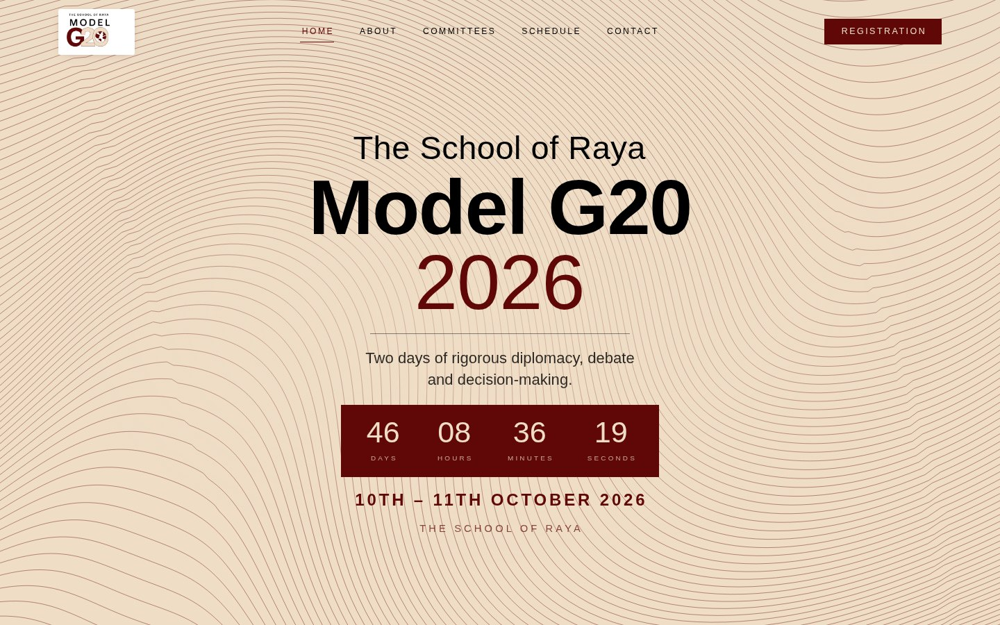
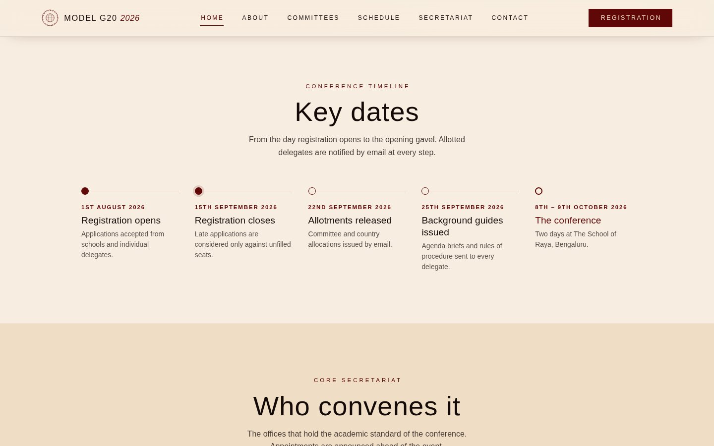
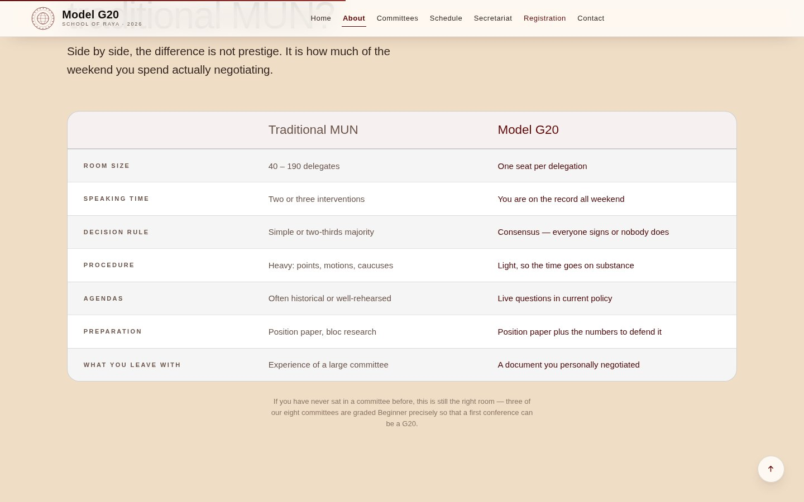
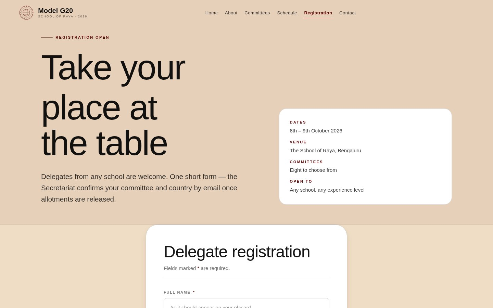
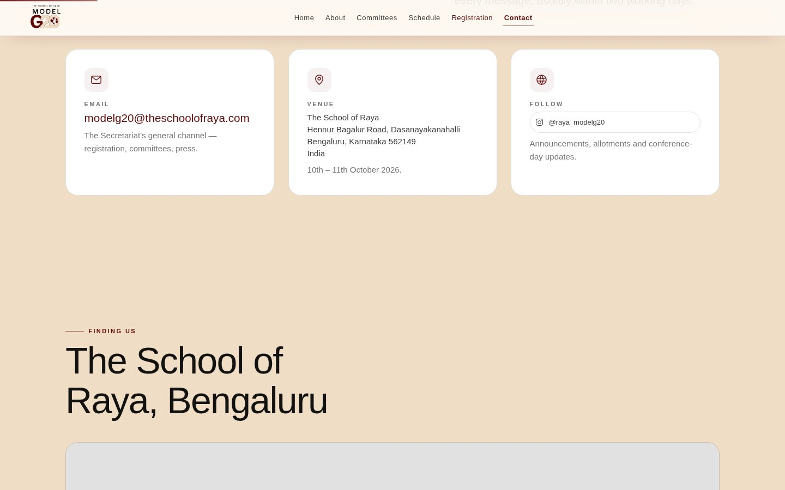
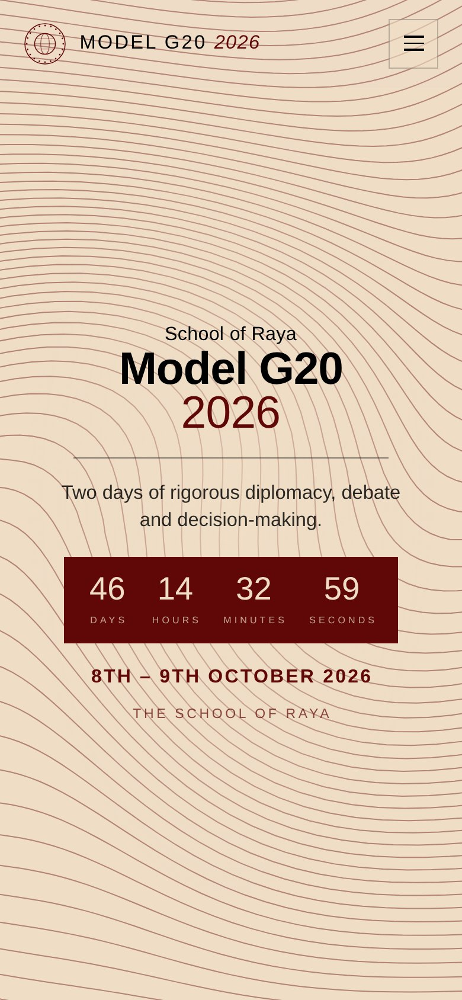

<div align="center">


# School of Raya Model G20 2026

**Two days of rigorous diplomacy, debate and decision-making**
The School of Raya, Bengaluru · 8th – 9th October 2026

[**View the live site →**][live]


<br>



</div>

---

## What this is

The official website for School of Raya Model G20 2026 — an eight-committee
conference simulation held over two days in Bengaluru. Seven pages covering the
conference from first visit through to a submitted registration.

It is **zero-dependency**: no framework, no bundler, no `node_modules`, no build
service. Seven HTML pages, four stylesheets, three scripts. The generated HTML
is committed, so any static host serves it straight from the repository root.

|                   |                                                        |
| ----------------- | ------------------------------------------------------ |
| **Live site**     | [Netlify][live]                                         |
| **Editing guide** | [EDITING.md](EDITING.md) — written for a non-developer  |
| **Content file**  | `assets/js/data.js` — committees, team, dates, contacts |

---

## Screens

<table>
<tr>
<td width="50%"><br><b>Committees</b><br><sub>Eight committees in a single grid — no tracks, no classifications. Each card carries an icon, a difficulty badge and the agenda in full.</sub></td>
<td width="50%"><br><b>Conference timeline</b><br><sub>Five milestones from registration opening to the opening gavel, rendered on the homepage in one row.</sub></td>
</tr>
<tr>
<td width="50%"><br><b>Why a G20, not a MUN</b><br><sub>The About page answers three questions with cards, a numbered reason list and this comparison — which collapses to stacked pairs on a phone.</sub></td>
<td width="50%"><br><b>Registration</b><br><sub>Its own page, with a hero banner, three-step instructions and an eight-field form wired to Netlify Forms out of the box.</sub></td>
</tr>
<tr>
<td width="50%"><br><b>Contact</b><br><sub>Email, telephone, the venue address, an embedded Google Map and a contact form — the map needs no API key.</sub></td>
<td width="50%" align="center"><br><b>Responsive</b><br><sub>Fluid rather than stepped: type and spacing scale with <code>clamp()</code>, and the navigation collapses to a full-screen sheet below 900px.</sub></td>
</tr>
</table>

---

## Highlights

- **Live countdown** to the opening gavel, on the homepage, in the mobile drawer,
  on the schedule page and in the footer — all reading one ISO timestamp.
- **Homepage keeps its animated line field**; every interior page runs a solid
  ground and a quieter surface treatment, by design.
- **Content lives in one file.** Add a committee to `assets/js/data.js` and it
  appears on the committees page and in the registration dropdown at once.
- **The registration form actually posts.** Netlify Forms needs nothing beyond
  what is already in the markup; swapping to Google Forms is documented inline
  at the top of `src/pages/register.html`.
- **Degrades honestly.** With JavaScript off the pages still read; with
  `prefers-reduced-motion` every transition collapses and reveals resolve to
  their final state.

---

## Quick start

```bash
git clone https://github.com/adhvik052008-hub/Model-G20-Website.git
cd Model-G20-Website

# Serve locally — any static server works
python3 -m http.server 8000       # → http://localhost:8000

# After editing anything in src/, rebuild the pages
python3 build.py
```

No install step, nothing to fetch. `python3` is needed only for the build.

---

## Deploying

The generated HTML is committed, so **there is no build command**. Point the
host at the repository root and it serves.

### Netlify

| Setting           | Value               |
| ----------------- | ------------------- |
| Build command     | *(leave empty)*     |
| Publish directory | `.`                 |
| Branch            | your default branch |

Netlify detects the two forms (`registration` and `contact`) on the first
deploy; submissions land under **Site → Forms**, where you can add email
notifications. To serve the styled 404 page and cache assets, add a
`netlify.toml`:

```toml
[[redirects]]
  from = "/*"
  to = "/404.html"
  status = 404

[[headers]]
  for = "/assets/*"
  [headers.values]
    Cache-Control = "public, max-age=31536000, immutable"
```

### GitHub Pages

Settings → Pages → Deploy from a branch → your branch, folder `/ (root)`. Note
that Netlify Forms will not work there — connect the forms to Google Forms or
another endpoint instead.

---

## How the build works

Pages are assembled from a shared shell so the navigation, footer and `<head>`
cannot drift across pages.

```
src/partials/head.html      <head> template — meta, OG tags, schema.org
src/partials/header.html    Skip link, curtain, glass nav, mobile drawer
src/partials/footer.html    Footer — contact, address, map, socials
src/partials/crest.svg      The seal, inlined everywhere it appears

src/pages/*.html            Page content only, with front matter
build.py                    The assembler
↓
index.html, about.html, …   Generated — do not hand-edit
```

**Edit `src/pages/`, never the generated root HTML.** If you edit a generated
page by mistake the build notices, refuses to overwrite it, and tells you how to
keep or discard the change. `python3 build.py --force` overwrites regardless;
`--check` reports without writing.

Front matter sits in an HTML comment at the top of each page file:

```html
<!--meta
title: Committees
nav: committees
description: Used for <title>, the meta description and the OG/Twitter tags.
-->
```

| Key           | Purpose                                                       |
| ------------- | ------------------------------------------------------------- |
| `title`       | Page title; ` — Model G20 2026` is appended                   |
| `nav`         | Which nav item gets `aria-current="page"`                     |
| `description` | Meta description and social card copy                         |
| `scripts`     | Extra scripts for this page only, comma-separated             |
| `body_class`  | Optional class on `<body>`                                    |
| `standalone`  | `true` copies the file through untouched, bypassing the shell |

### The homepage is different

`src/pages/index.html` carries `standalone: true`, so the build copies it
through byte for byte. It is a complete HTML document with its own styling, its
own navigation and its own animated canvas, and it uses none of the shared
shell. Edit it like any ordinary HTML file — its ten likely edit points are
numbered `EDIT 1` … `EDIT 10` inside it.

---

## Project layout

```
assets/css/tokens.css       Design tokens — colour, type, space, motion, elevation
assets/css/base.css         Reset, ground, typography, layout primitives, a11y
assets/css/components.css   Buttons, cards, nav, forms, badges
assets/css/pages.css        Page layouts + the conference components

assets/js/data.js           All conference content ← edit this
assets/js/render.js         Turns the data into DOM
assets/js/app.js            Nav, reveals, countdown, forms

assets/img/favicon.svg      The seal
assets/img/og.svg           Social card — see "Before launch"
assets/img/partners/        Partner logos (placeholders as shipped)
docs/preview/               The screenshots used in this README
```

---

## Design language

| Token            | Value     | Role                                            |
| ---------------- | --------- | ----------------------------------------------- |
| Parchment        | `#EFDDC6` | The page ground                                 |
| Sovereign Maroon | `#600808` | Primary action, active state, inverted sections |
| Ivory            | `#FFFFFF` | Card surfaces                                   |
| Ink              | `#000000` | Type                                            |

**Those four are the only colours on the site.** Every stylesheet and every page
was audited: the CSS contains exactly four hex literals, and every tint, rule,
shadow and muted text colour is one of those four at reduced opacity, letting
the ground show through. There is no fifth value anywhere. (Partner logos, once
supplied, carry their own brand colours — as they should.)

Type is **Helvetica** throughout, falling back to Arial and Liberation Sans,
with IBM Plex Mono for tabular figures. Nothing but the monospace face is
fetched over the network, and the homepage fetches nothing at all.

Maroon on parchment measures ≈9.4:1; parchment on maroon-800 ≈11:1. No
text-bearing pair falls below 4.5:1.

---

## Accessibility

- Skip link, semantic landmarks, one `<h1>` per page
- Full keyboard operation; focus visible throughout
- Countdown announces on the day boundary, not every second
- `prefers-reduced-motion` collapses all transitions and resolves reveals to
  their final state
- Reveal animations are scoped to `html.js`, so a visitor without JavaScript
  sees fully rendered content rather than a blank page
- Verified at 1440px and 390px across every page: no horizontal scroll, no
  overflowing elements, no missing `alt`

---

## Logos

Three slots are wired and waiting. Drop a file at the exact path and it
appears — there is no code to change, and until the file exists a drawn
stand-in shows instead, so the page is never broken.

| Slot | Path |
| --- | --- |
| Model G20 emblem (top-left of the home page) | `assets/img/logo-modelg20.png` |
| Flame University | `assets/img/partners/flame-university.png` |
| One Young India | `assets/img/partners/one-young-india.png` |

`.png`, `.jpg` or `.svg` all work as long as the filename matches. Images are
scaled with `object-fit: contain`, so any aspect ratio fits without distortion.

Note that official logos carry their own brand colours — Flame's navy and gold,
the Model G20 emblem's blue, green, yellow and red. Those sit outside the
four-colour palette by design; a logo is not repainted to match a site.

---

## Before launch

Everything below ships as a placeholder:

1. **Phone number** — `EVENT.phone` (`+91 80 4000 1234`) in `assets/js/data.js`,
   and the same number written into the home page's contact section. The email
   address, `modelg20@theschoolofraya.com`, is real.
2. **Team portraits** — every card draws an initials plate. Add
   `photo: "assets/img/team/their-file.jpg"` to any entry in `SECRETARIAT` or
   `ORGANISING` in `data.js` for a real portrait, cropped square. The home
   page's cards are hand-written under `EDIT 9` and `EDIT 10`.
3. **Logos** — see the table above.
4. **Partner website links** — the two "Visit website" links point at `#`.
5. **Social media** — the four handles in `SOCIALS` point at `#`.
6. **Map pin** — the embed points at the postal address. If the pin lands
   slightly off, change `EVENT.mapQuery` in `data.js` and the `q=` value in the
   home page's map iframe.
7. **Social card** — export `assets/img/og.svg` to a 1200×630 **PNG** and update
   the `og:image` path in `src/partials/head.html`; several platforms will not
   render an SVG preview.

---

## Browser support

Current Chrome, Edge, Firefox and Safari. Uses `backdrop-filter`, custom
properties, `aspect-ratio` and `IntersectionObserver`. Older browsers lose the
glass blur and some reveal animation; layout and content remain intact.

---

## Licence

Code: see [LICENSE](LICENSE). Conference content, the crest and the wordmark are
the property of The School of Raya.

<!-- ─────────────────────────────────────────────────────────────────────────
     THE LIVE SITE ADDRESS — change this one line and every link above
     updates with it.
     ───────────────────────────────────────────────────────────────────────── -->
[live]: https://YOUR-SITE.netlify.app
