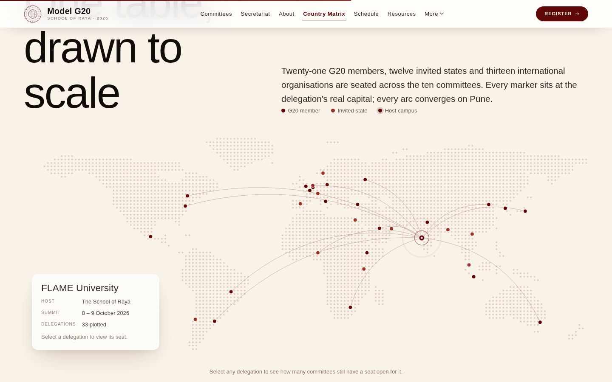
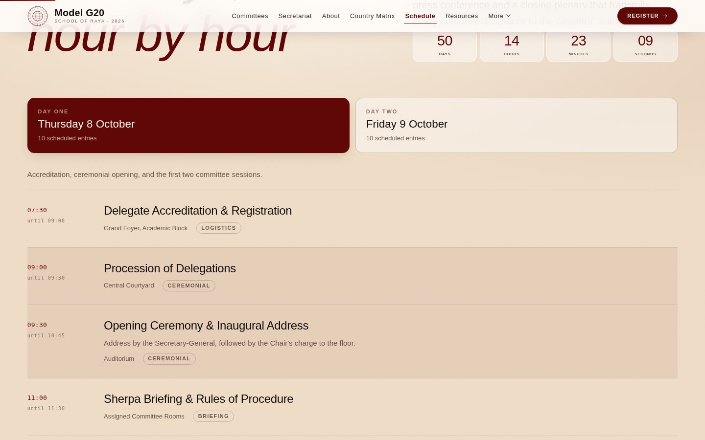
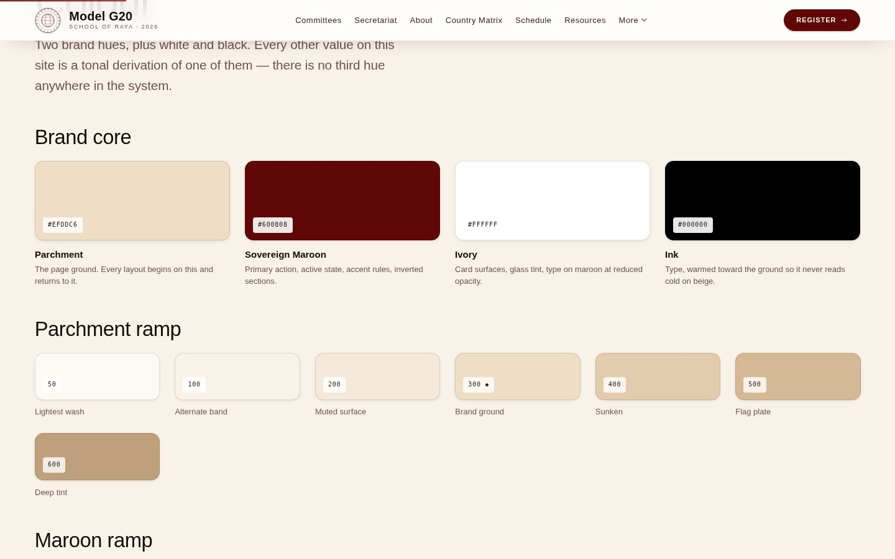

<div align="center">


# Model G20 2026

**An international summit simulation convened by The School of Raya**
FLAME University, Pune · 8 – 9 October 2026

[**View the live site →**][live]

<!-- Static badges: no build service is wired up, so nothing here can go stale. -->


<br>


</div>

---

## What this is

A complete, production-ready front end for a Model G20 conference — fourteen
pages covering the summit from first visit through to a submitted registration.
It is built to read as an international diplomatic summit rather than a school
event: restrained palette, editorial typography, real cartography, and no
stock-template furniture anywhere in it.

It is also **zero-dependency**. No framework, no bundler, no `node_modules`, no
build service. Fourteen HTML pages, four stylesheets, six scripts. The generated
HTML is committed, so any static host serves it straight from the repository
root.

|                     |                                                          |
| ------------------- | -------------------------------------------------------- |
| **Live site**       | [Netlify][live]                                           |
| **Design system**   | [`design-system.html`][live-ds] — rendered from the live stylesheets |
| **Wireframes & IA** | [`wireframes.html`][live-wf]                              |
| **Editing guide**   | [EDITING.md](EDITING.md) — written for a non-developer    |

---

## Screens

<table>
<tr>
<td width="50%"><br><b>Delegation map</b><br><sub>Forty-six delegations plotted at their real capitals on an equirectangular projection, with arcs converging on the host campus. Drawn from coastline geometry, not an image.</sub></td>
<td width="50%"><br><b>Committees</b><br><sub>Ten committees across the Sherpa and Finance tracks. Seat counts are derived from each committee's delegation pool, so a card can never disagree with the country matrix.</sub></td>
</tr>
<tr>
<td width="50%"><br><b>Registration wizard</b><br><sub>Five steps with per-step validation, deep-linkable committee preselection, a live review summary, and draft persistence in <code>localStorage</code>.</sub></td>
<td width="50%"><br><b>Schedule</b><br><sub>The two-day programme, hour by hour, rendered from a single data file alongside a live countdown to the opening gavel.</sub></td>
</tr>
<tr>
<td width="50%"><br><b>Design system</b><br><sub>Palette, type scale, spacing, elevation, motion and the full component library — generated from the same stylesheets the site uses, so it cannot drift.</sub></td>
<td width="50%" align="center"><br><b>Responsive</b><br><sub>Every layout is fluid rather than stepped: type and spacing scale with <code>clamp()</code>, and the navigation collapses to a full-screen drawer below 900px.</sub></td>
</tr>
</table>

---

## Highlights

- **Live countdown** to the opening gavel, on the cover, in the drawer and beside
  the schedule — all reading one ISO timestamp.
- **Interactive delegation map** built from generalised world geometry with
  even-odd ray casting for point-in-polygon land tests. Keyboard operable.
- **Country matrix** — forty-six delegations against ten committees, with search,
  region and committee filters, and an open-seats-only toggle.
- **Glassmorphism** navigation and panels, warm maroon-tinted elevation, and an
  SVG turbulence paper grain that keeps flat colour from reading as flat screen.
- **Canvas line field** on the cover: three Gaussian-falloff vortices, one
  following the pointer and two driven by scroll.
- **Content lives in one file.** Add a committee to `assets/js/data.js` and it
  appears on the committees page, in the matrix, and in the registration
  dropdowns at once — no markup to touch.
- **Degrades honestly.** With JavaScript off the pages still read; with
  `prefers-reduced-motion` every transition collapses and reveals resolve to
  their final state.

---

## Quick start

```bash
git clone https://github.com/adhvik052008-hub/Model-G20-Website.git
cd Model-G20-Website

# Serve locally — any static server works
python3 -m http.server 8000       # → http://localhost:8000

# After editing anything in src/, rebuild the pages
python3 build.py
```

No install step, nothing to fetch. `python3` is the only requirement, and only
for the build.

> Opening `index.html` by double-clicking mostly works, but the committee
> listings and country matrix stay blank — browsers block those scripts over
> `file://`. Use the server.

---

## Deploying

The generated HTML is committed, so **there is no build command**. Point the
host at the repository root and it serves.

### Netlify

| Setting            | Value                     |
| ------------------ | ------------------------- |
| Build command      | *(leave empty)*           |
| Publish directory  | `.`                       |
| Branch             | your default branch       |

Nothing else is required. If you want Netlify to serve the styled 404 page and
add long-lived caching for assets, drop this in as `netlify.toml`:

```toml
[[redirects]]
  from = "/*"
  to = "/404.html"
  status = 404

[[headers]]
  for = "/assets/*"
  [headers.values]
    Cache-Control = "public, max-age=31536000, immutable"
```

### GitHub Pages

Settings → Pages → Deploy from a branch → your branch, folder `/ (root)`.

If the site is served from a project subpath, update `BASE_URL` in `build.py`
and rebuild so the canonical and social URLs are right. Every internal link is
relative and works from any subpath unchanged.

---

## How the build works

Pages are assembled from a shared shell so the navigation, footer and `<head>`
cannot drift across fourteen pages.

```
src/partials/head.html      <head> template — meta, OG tags, schema.org
src/partials/header.html    Skip link, curtain, glass nav, mobile drawer
src/partials/footer.html    Footer, back-to-top
src/partials/crest.svg      The seal, inlined everywhere it appears

src/pages/*.html            Page content only, with front matter
build.py                    The assembler
↓
index.html, about.html, …   Generated — do not hand-edit
```

**Edit `src/pages/`, never the generated root HTML.** If you edit a generated
page by mistake the build notices, refuses to overwrite it, and tells you how to
keep or discard the change. `python3 build.py --force` overwrites regardless;
`--check` reports without writing.

Front matter sits in an HTML comment at the top of each page file:

```html
<!--meta
title: Committees
nav: committees
description: Used for <title>, the meta description and the OG/Twitter tags.
scripts: matrix.js
-->
```

| Key           | Purpose                                                       |
| ------------- | ------------------------------------------------------------- |
| `title`       | Page title; ` — Model G20 2026` is appended                   |
| `nav`         | Which nav item gets `aria-current="page"`                     |
| `description` | Meta description and social card copy                         |
| `scripts`     | Extra scripts for this page only, comma-separated             |
| `body_class`  | Optional class on `<body>`                                    |
| `standalone`  | `true` copies the file through untouched, bypassing the shell |

### The cover page is different

`src/pages/index.html` carries `standalone: true`, so the build copies it
through byte for byte. It is a complete HTML document with its own styling, its
own reduced navigation and its own animated canvas, and it uses none of the
shared shell. Edit it like any ordinary HTML file — its eight likely edit points
are numbered `EDIT 1` … `EDIT 8` inside it.

### Adding a page

1. Create `src/pages/your-page.html` with front matter.
2. Add the slug to `PAGE_ORDER` in `build.py` (ordering only — an unlisted page
   still builds, and is flagged in the log).
3. Link it from `src/partials/header.html` and `src/partials/footer.html`.
4. Run `python3 build.py`.

---

## Project layout

```
assets/css/tokens.css       Design tokens — colour, type, space, motion, elevation
assets/css/base.css         Reset, ground, typography, layout primitives, a11y
assets/css/components.css   25 components, all context-aware
assets/css/pages.css        Layouts that exist exactly once

assets/js/world.js          World geometry + equirectangular projection
assets/js/data.js           All conference content ← edit this
assets/js/render.js         Renders data into the DOM
assets/js/map.js            Dot-matrix delegation map
assets/js/matrix.js         Country matrix search/filter (matrix page only)
assets/js/app.js            Nav, reveals, countdown, modals, forms, wizard

assets/img/favicon.svg      The seal
assets/img/og.svg           Social card — see "Before launch"
docs/preview/               The screenshots used in this README
```

Committees, delegations, the schedule, FAQs, Secretariat offices, resources,
gallery entries and fee tiers all live in **`assets/js/data.js`**. Editing that
file changes the site; no markup edits required.

---

## Design language

| Token            | Value     | Role                                            |
| ---------------- | --------- | ----------------------------------------------- |
| Parchment        | `#EFDDC6` | The page ground                                 |
| Sovereign Maroon | `#600808` | Primary action, active state, inverted sections |
| Ivory            | `#FFFFFF` | Card surfaces, glass tint                       |
| Ink              | `#000000` | Type, warmed toward the ground                  |

Every other value in the system is a tonal derivation of those two brand hues —
there is no third hue anywhere.

Type is **Helvetica** throughout, falling back to Arial and Liberation Sans, with
IBM Plex Mono for tabular data. Nothing but the monospace face is fetched over
the network, and the cover page fetches nothing at all.

Maroon on parchment measures ≈9.4:1; parchment on maroon-800 ≈11:1. No
text-bearing pair falls below 4.5:1.

---

## Accessibility

- Skip link, semantic landmarks, one `<h1>` per page
- Full keyboard operation, including the map's delegation pins
- Focus trapped in modals and restored to the opener on close
- Countdown announces on the day boundary, not every second
- `prefers-reduced-motion` collapses all transitions, resolves reveals to their
  final state, drops the paper grain and does not mount the custom cursor
- Reveal animations are scoped to `html.js`, so a visitor without JavaScript
  sees fully rendered content rather than a blank page

---

## Before launch

This is a complete front end. Six things need real values first:

1. **Contact details** — `EVENT.email`, `EVENT.emailDelegates`, `EVENT.emailPress`
   and `EVENT.phone` in `assets/js/data.js`, the four addresses on
   `src/pages/contact.html`, and the Contact block on the cover are all
   `…@modelg20.example` placeholders. Social links and the partner's website
   link point at `#`.
2. **Secretariat appointments** — offices render "Appointment announced ahead of
   summit". Add a `name` key to any office in `SECRETARIAT` to show a name.
3. **Seat availability** — `statusFor()` in `data.js` generates availability
   deterministically so the matrix demonstrates realistic density. Replace it
   with a lookup against the real allotment sheet.
4. **Fees and deadlines** — `FEES`, `ACCOMMODATION` and `EVENT.deadlines` carry
   indicative figures, and the accommodation rate is scaled arithmetic rather
   than a quoted price.
5. **Documents** — Resources links have no files behind them. Put PDFs in
   `assets/docs/` and point the links there.
6. **Forms** — the contact form and registration wizard validate fully and show
   their success states, but nothing is transmitted; there is no backend. Point
   them at Netlify Forms, Formspree, a Google Form or your own endpoint.

Also worth doing: export `assets/img/og.svg` to a 1200×630 **PNG** and update the
`og:image` path in `src/partials/head.html` — several social platforms will not
render an SVG preview.

Gallery images are generated placeholder compositions. Add a `src` key to any
entry in `GALLERY` and it renders that photograph instead, in the grid and in
the lightbox.

---

## Browser support

Current Chrome, Edge, Firefox and Safari. Uses `backdrop-filter`, `:has()`,
custom properties, `grid-template-rows` transitions and `IntersectionObserver`.
Older browsers lose the glass blur and some reveal animation; layout and content
remain intact.

---

## Licence

Code: see [LICENSE](LICENSE). Conference content, the crest and the wordmark are
the property of The School of Raya.

<!-- ─────────────────────────────────────────────────────────────────────────
     THE LIVE SITE ADDRESS — change these three lines and every link above
     updates with them.
     ───────────────────────────────────────────────────────────────────────── -->
[live]:    https://YOUR-SITE.netlify.app
[live-ds]: https://YOUR-SITE.netlify.app/design-system.html
[live-wf]: https://YOUR-SITE.netlify.app/wireframes.html
